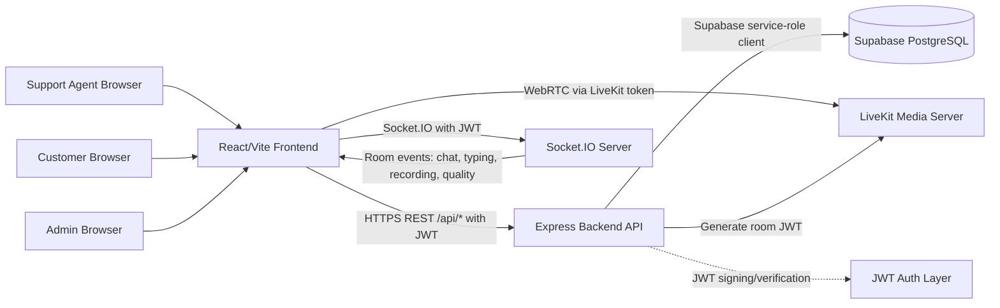
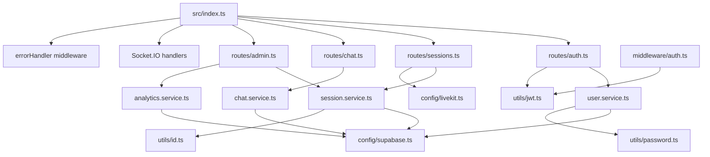
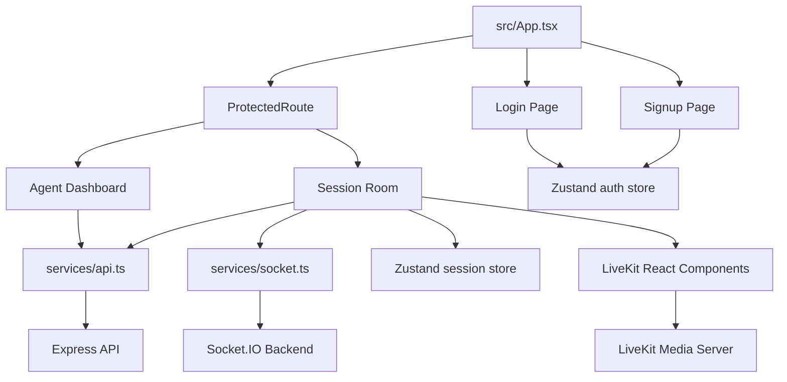
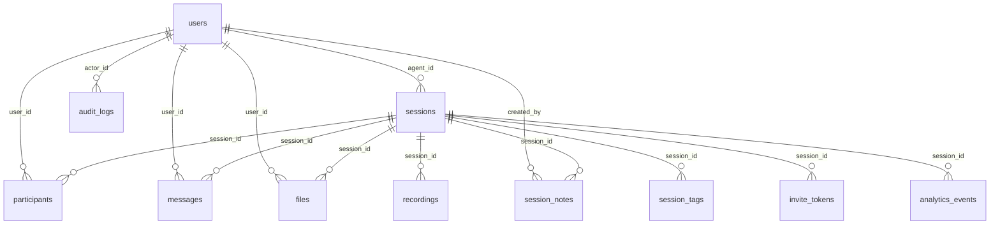
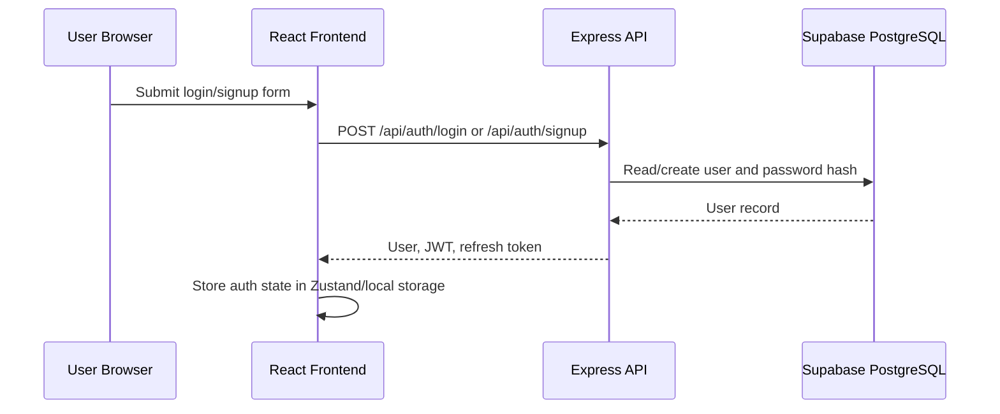
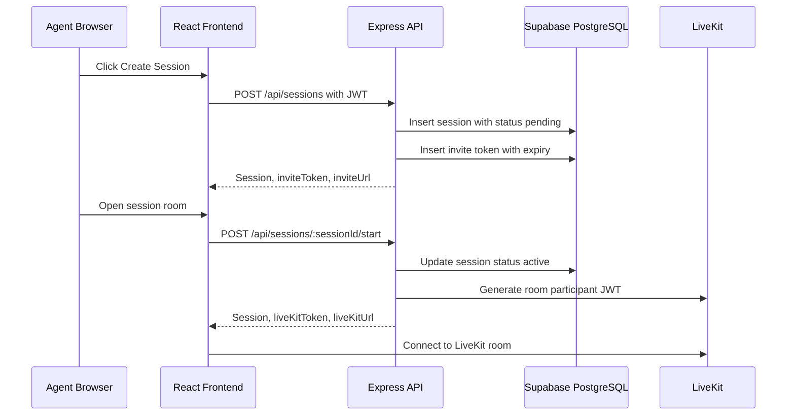
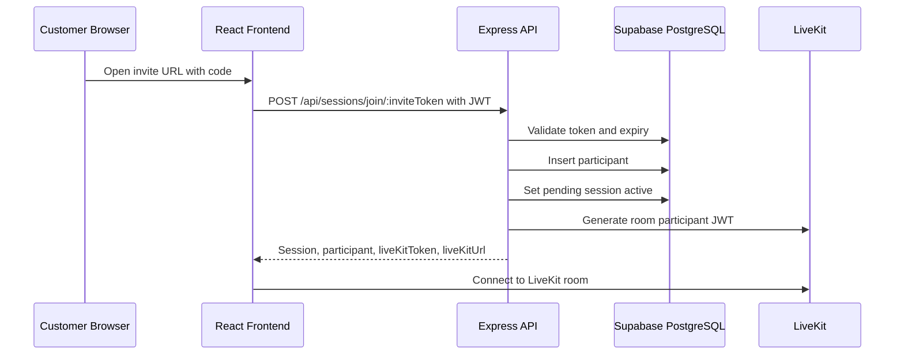
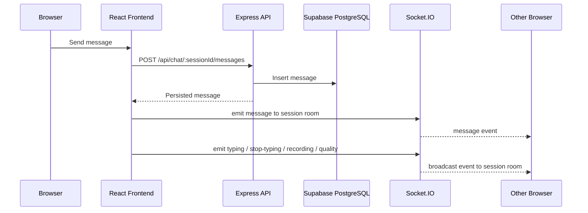
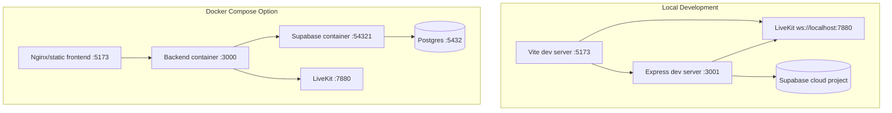

# AtomAssist Architecture Diagram Brief

Use this file as the source prompt/spec for generating an architecture diagram of AtomAssist.

## One-Line Summary

AtomAssist is a real-time video support platform where agents create support sessions, customers join through invite tokens, LiveKit carries audio/video, Socket.IO carries real-time collaboration events, and an Express API persists users, sessions, chat, files, recordings, analytics, and audit data in Supabase/PostgreSQL.

## Primary Actors

- Support Agent: logs in, creates sessions, starts/ends sessions, joins video rooms, sends chat messages, reviews session history.
- Customer: signs up/logs in, joins a session through an invite token, joins the LiveKit room, sends chat messages and files.
- Admin: monitors active sessions, views metrics, reads audit logs, can end sessions.

## Runtime Components

- Frontend Web App
  - React 18 + TypeScript + Vite
  - React Router for pages
  - React Query for API polling/cache
  - Zustand for auth/session state
  - LiveKit React Components for video UI
  - Socket.IO client for real-time events
  - TailwindCSS for styling

- Backend API
  - Node.js + Express + TypeScript
  - REST API under `/api`
  - JWT authentication middleware
  - Role-based authorization for agent/admin routes
  - Socket.IO server attached to the same HTTP server
  - LiveKit Server SDK for room access token generation
  - Supabase JS service-role client for database access

- LiveKit Media Server
  - Handles WebRTC audio/video transport
  - Backend creates participant JWTs with room grants
  - Frontend connects through `LiveKitRoom`

- Supabase/PostgreSQL
  - System of record for users, sessions, participants, messages, files, recordings, notes, tags, invite tokens, audit logs, metrics, and analytics events
  - Application-layer authorization is handled by Express middleware

## High-Level System Diagram

## Backend Module Diagram

## Frontend Page Diagram

## Core Data Model

## Main User Flows

### Authentication

### Agent Creates And Starts A Session

### Customer Joins A Session

### Chat And Realtime Events

## REST API Surface

- `POST /api/auth/signup`: create customer user and return JWT.
- `POST /api/auth/login`: validate password and return JWT.
- `POST /api/sessions`: agent creates a pending session and invite token.
- `GET /api/sessions/agent`: agent lists own sessions.
- `GET /api/sessions/:sessionId`: fetch session and participants.
- `POST /api/sessions/join/:inviteToken`: validate invite, add customer participant, return LiveKit credentials.
- `POST /api/sessions/:sessionId/start`: agent starts session and receives LiveKit credentials.
- `POST /api/sessions/:sessionId/end`: agent/admin ends session.
- `GET /api/sessions`: admin lists active sessions.
- `GET /api/chat/:sessionId`: fetch messages.
- `POST /api/chat/:sessionId/messages`: persist text message.
- `POST /api/chat/:sessionId/messages/:messageId/read`: mark message read.
- `POST /api/chat/:sessionId/files`: store file metadata and create file message.
- `GET /api/chat/:sessionId/files`: list files.
- `GET /api/admin/sessions/active`: admin active sessions.
- `GET /api/admin/sessions`: admin paginated session list.
- `GET /api/admin/sessions/:sessionId`: admin session details.
- `POST /api/admin/sessions/:sessionId/end`: admin override end session.
- `GET /api/admin/metrics`: session and recording metrics.
- `GET /api/admin/logs`: audit logs.
- `GET /api/admin/logs/session/:sessionId`: audit logs for one session.

## Socket.IO Event Surface

- Client emits: `join-session`, `leave-session`, `message`, `typing`, `stop-typing`, `recording-started`, `recording-stopped`, `connection-quality`.
- Server emits: `user-joined`, `user-left`, `message`, `user-typing`, `user-stopped-typing`, `recording-started`, `recording-stopped`, `connection-quality`.
- Socket authentication: JWT passed in `socket.handshake.auth.token`.
- Socket room pattern: `session:{sessionId}`.

## Deployment View

## Security Boundaries

- Browser stores JWT and sends it to REST API through `Authorization: Bearer`.
- Express validates JWT with `JWT_SECRET`.
- Express role middleware restricts agent and admin operations.
- Supabase service key is backend-only and must never be exposed to the frontend.
- LiveKit API secret is backend-only; frontend receives only participant room JWTs.
- Invite tokens expire after 24 hours.
- Passwords are hashed with bcrypt before storage.

## Current Implementation Notes

- Local backend port is `3001`.
- Local frontend port is `5173`.
- Local frontend API base must include `/api`: `VITE_API_URL=http://localhost:3001/api`.
- Docker is described in the repo, but Docker is not available on this machine's PATH.
- Admin users route to `/admin/dashboard`.
- Agents receive LiveKit credentials from `POST /api/sessions/:sessionId/start`.
- Customers receive LiveKit credentials from `POST /api/sessions/join/:inviteToken`.
- The customer join page is available at `/join` and accepts `?code=INVITE_TOKEN`.
- LiveKit local URL is configured as `ws://localhost:7880`; a LiveKit server must be running for video rooms to connect.

## Diagram Generator Prompt

Create a clean architecture diagram for "AtomAssist - Real-Time Video Support Platform".

Show three user actors: Support Agent, Customer, and Admin. Show a React/Vite frontend connected to an Express/TypeScript backend by REST over HTTPS and Socket.IO. Show the frontend connecting directly to LiveKit for WebRTC audio/video using a LiveKit token received from the backend. Show the backend connected to Supabase/PostgreSQL through the Supabase service-role client. Show backend modules for auth, sessions, chat, admin, analytics, JWT middleware, LiveKit token generation, and Socket.IO session rooms. Show database tables grouped around sessions: users, sessions, participants, messages, files, recordings, session_notes, session_tags, invite_tokens, audit_logs, system_metrics, analytics_events. Label key flows: login/signup, create session, invite token join, LiveKit token generation, WebRTC media, persisted chat, realtime events, admin metrics/audit logs. Use clear boundaries for browser, backend, media server, and database.
