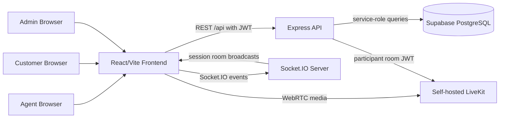

<p align="center">
  
</p>

# AtomAssist

**Visual Support. Instant Resolution.**

AtomAssist is a browser-based real-time video support platform built for the **AtomQuest Hackathon 1.0 Grand Finale** problem statement: help support agents resolve product issues with owned, server-routed video calls instead of blind voice-only troubleshooting.

The platform lets an agent create a support session, share an invite token with a customer, run an audio/video call through a media server, exchange in-call chat, persist the session record, and give admins visibility into live operations.

## Demo Login Credentials

Use these after running `backend/database.sql` and `backend/seed-demo-data.sql`.

| Role | Email | Password | Start Page |
| --- | --- | --- | --- |
| Agent | `agent@atomberg.com` | `agent123` | `/agent/dashboard` |
| Customer | `customer@atomberg.com` | `customer123` | `/join` |
| Admin | `admin@atomberg.com` | `admin123` | `/admin/dashboard` |

Seeded customer invite token:

```text
DEMO-CUSTOMER-JOIN
```

## Why This Matters

Customer support often breaks down when the agent needs visual context: installation wiring, device labels, error indicators, physical damage, or step-by-step setup. AtomAssist gives support teams a controlled video support layer with persisted history, role-based access, and an operations dashboard.

Unlike hosted video APIs, the media path is designed around a self-operated LiveKit server, so support interactions can remain inside infrastructure controlled by the team.

## Finale Requirement Coverage

| Requirement | AtomAssist Implementation |
| --- | --- |
| Agent creates session | Agent dashboard creates pending support sessions and generates invite tokens |
| Customer joins from browser | `/join?code=...` accepts invite tokens, no app install needed |
| Server-routed media | LiveKit media server handles WebRTC audio/video transport |
| Track participants | `participants` table records user, role, join/leave timestamps, device info, quality |
| End session cleanly | Agent/admin session end APIs update status and close the session record |
| Persist history | Sessions, participants, messages, files, recordings, notes, audit logs, analytics events |
| Audio/video controls | LiveKit React components provide mute, camera, and room controls |
| In-call chat | REST persistence plus Socket.IO realtime room broadcasts |
| Role enforcement | JWT auth plus Express role middleware for agent/admin actions |
| Valid invite required | Join route validates invite token and expiry |
| Admin dashboard | Live sessions, metrics, activity logs, admin session controls |
| Architecture write-up | See `ARCHITECTURE_DIAGRAM_BRIEF.md` |

## Product Highlights

- **Agent Dashboard**: create support sessions, see session history, open a live session room.
- **Customer Join Flow**: paste a token or open `/join?code=TOKEN` to enter a session.
- **Live Video Support**: LiveKit-powered room UI for audio/video support calls.
- **Realtime Chat**: persisted messages with Socket.IO delivery to active participants.
- **File Metadata Support**: file records are modeled and exposed through chat APIs.
- **Session Intelligence**: database support for notes, tags, recordings, summaries, and audit trails.
- **Admin Operations View**: active sessions, metrics, logs, and emergency end-session action.
- **Diagram-Ready Architecture Brief**: Mermaid diagrams and a prompt for generating polished diagrams.

## Tech Stack

| Layer | Technology |
| --- | --- |
| Frontend | React 18, TypeScript, Vite, React Router, React Query, Zustand, TailwindCSS |
| Video | LiveKit React Components, LiveKit Client, LiveKit Server SDK |
| Realtime | Socket.IO |
| Backend | Node.js, Express, TypeScript |
| Auth | JWT, bcrypt password hashing, role middleware |
| Database | Supabase PostgreSQL |
| Deployment | Vercel-ready frontend, Node backend, Docker Compose option |

## Architecture Snapshot



For the full architecture, data model, sequence diagrams, deployment view, and diagram-generator prompt, see:

[ARCHITECTURE_DIAGRAM_BRIEF.md](ARCHITECTURE_DIAGRAM_BRIEF.md)

## Quick Demo Flow

1. Start the backend, frontend, LiveKit, and database.
2. Log in as the agent:
   - `agent@atomberg.com`
   - `agent123`
3. Create a new session from the Agent Dashboard.
4. Copy the invite token or join URL shown in the session room.
5. In another browser/incognito window, log in as the customer:
   - `customer@atomberg.com`
   - `customer123`
6. Open `/join`, paste the invite token, and join the call.
7. Exchange chat messages during the session.
8. Log in as admin:
   - `admin@atomberg.com`
   - `admin123`
9. Open `/admin/dashboard` to view live sessions, metrics, and audit activity.

## Local Setup

### Prerequisites

- Node.js 20+
- npm
- A Supabase project or local PostgreSQL-compatible Supabase setup
- LiveKit server running locally or remotely

### 1. Install Dependencies

```bash
cd backend
npm install

cd ../frontend
npm install
```

### 2. Configure Environment

Create local env files from the examples:

```bash
cp backend/.env.example backend/.env
cp frontend/.env.example frontend/.env
```

Backend essentials:

```env
SUPABASE_URL=...
SUPABASE_ANON_KEY=...
SUPABASE_SERVICE_KEY=...
JWT_SECRET=...
LIVEKIT_URL=ws://localhost:7880
LIVEKIT_API_KEY=devkey
LIVEKIT_API_SECRET=secret
PORT=3001
FRONTEND_URL=http://localhost:5173
CORS_ORIGIN=http://localhost:5173
```

Frontend essentials:

```env
VITE_API_URL=http://localhost:3001/api
VITE_SOCKET_URL=http://localhost:3001
VITE_LIVEKIT_URL=ws://localhost:7880
```

### 3. Initialize Database

Run the schema first, then the demo seed:

```sql
-- In Supabase SQL editor or psql
\i backend/database.sql
\i backend/seed-demo-data.sql
```

If using the Supabase SQL editor, paste and run `backend/database.sql`, then paste and run `backend/seed-demo-data.sql`.

### 4. Start LiveKit

With Docker:

```bash
docker run --rm -p 7880:7880 -p 7881:7881 -p 7882:7882/udp livekit/livekit-server --dev
```

Or use the included `livekit.yaml` with your preferred LiveKit deployment.

### 5. Start Backend

```bash
cd backend
npm run dev
```

Expected:

```text
Server running on http://localhost:3001
Environment: development
```

Health check:

```bash
curl http://localhost:3001/health
```

### 6. Start Frontend

```bash
cd frontend
npm run dev
```

Open:

```text
http://localhost:5173
```

## API Overview

### Auth

- `POST /api/auth/signup`
- `POST /api/auth/login`

### Sessions

- `POST /api/sessions`
- `GET /api/sessions/agent`
- `GET /api/sessions/:sessionId`
- `POST /api/sessions/join/:inviteToken`
- `POST /api/sessions/:sessionId/start`
- `POST /api/sessions/:sessionId/end`

### Chat

- `GET /api/chat/:sessionId`
- `POST /api/chat/:sessionId/messages`
- `POST /api/chat/:sessionId/messages/:messageId/read`
- `POST /api/chat/:sessionId/files`
- `GET /api/chat/:sessionId/files`

### Admin

- `GET /api/admin/sessions`
- `GET /api/admin/sessions/active`
- `GET /api/admin/sessions/:sessionId`
- `POST /api/admin/sessions/:sessionId/end`
- `GET /api/admin/metrics`
- `GET /api/admin/logs`

## Realtime Events

Socket authentication uses the same JWT as the REST API.

Client emits:

- `join-session`
- `leave-session`
- `message`
- `typing`
- `stop-typing`
- `recording-started`
- `recording-stopped`
- `connection-quality`

Server broadcasts:

- `user-joined`
- `user-left`
- `message`
- `user-typing`
- `user-stopped-typing`
- `recording-started`
- `recording-stopped`
- `connection-quality`

## Database Model

Core tables:

- `users`
- `sessions`
- `participants`
- `messages`
- `files`
- `recordings`
- `session_notes`
- `session_tags`
- `invite_tokens`
- `audit_logs`
- `system_metrics`
- `analytics_events`

The schema is optimized around session history: every call can retain participants, chat, files, recording metadata, internal notes, tags, metrics, and audit events.

## Security Notes

- Passwords are hashed with bcrypt.
- JWTs protect REST and Socket.IO access.
- Agent and admin actions are protected by role middleware.
- Invite-token validation is required for customer join.
- Supabase service key and LiveKit API secret are backend-only.
- `.env` files are intentionally ignored; use `.env.example` for setup.

## Verification Commands

```bash
cd backend
npm run typecheck

cd ../frontend
npm run build
```

## Known Limitations

- LiveKit must be running for actual audio/video calls.
- The recording model, status events, and database fields are present; production recording export requires wiring LiveKit Egress or equivalent object storage.
- File sharing currently stores file metadata and URLs; production upload storage should be connected to Supabase Storage or another secure object store.
- Reconnect grace-window behavior is represented in the architecture and Socket.IO lifecycle, but a production-grade reconnection state machine would need deeper hardening.

## Repository Structure

```text
atomassist/
  backend/
    src/
      config/        Supabase and LiveKit clients
      middleware/    JWT auth and role enforcement
      routes/        Auth, session, chat, admin APIs
      services/      Database/service layer
      utils/         JWT, password, IDs, errors
    database.sql
    seed-demo-data.sql
  frontend/
    src/
      components/
      pages/         Login, signup, agent, join, session, admin
      services/      REST and Socket.IO clients
      stores/        Zustand state
  docs/
    assets/
  ARCHITECTURE_DIAGRAM_BRIEF.md
```

## Judge-Friendly Summary

AtomAssist directly addresses the finale prompt with a complete browser-first support workflow: role-based session creation, invite-based customer entry, server-routed audio/video, realtime chat, persisted call history, and admin observability. The design separates frontend experience, API authorization, realtime events, media transport, and persistent data so the platform can scale beyond a single demo session.
